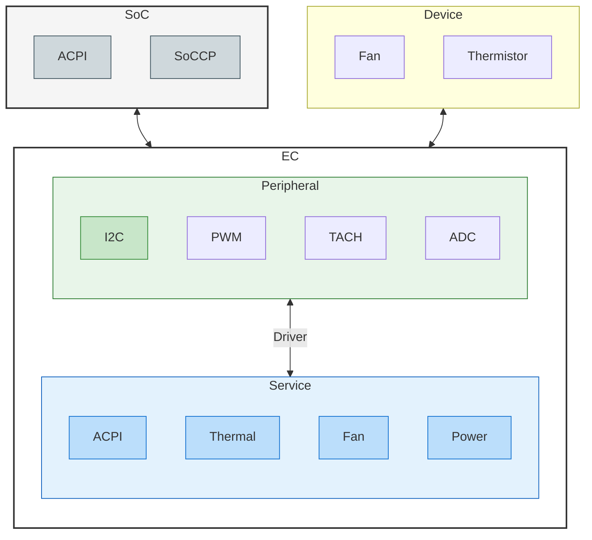

# EC Firmware For Qualcomm

## 1. System Architecture Diagram

## 2. Directory Responsibilities

### 📂 `app/interface` (Interface Layer)

### 📂 `app/service` (Core Logic Layer)

### 📂 `app/driver` (Driver Layer / Infrastructure)
