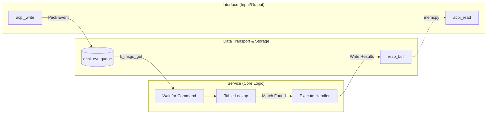

# ACPI service

## Architecture


## Test
```shell
uart:~$
uart:~$ acpi read
ACPI Read Response:
00000000: 00 00 00 00 00 00 00 00  00 00 00 00 00 00 00 00 |........ ........|
00000010: 00 00 00 00 00 00 00 00  00 00 00 00 00 00 00 00 |........ ........|
00000020: 00 00 00 00 00 00 00 00  00 00 00 00 00 00 00 00 |........ ........|
00000030: 00 00 00 00 00 00 00 00  00 00 00 00 00 00 00 00 |........ ........|
uart:~$
uart:~$
uart:~$ acpi write 0x0E
ACPI CMD written successfully
[00:05:27.850,738] <inf> acpi: Handled ACPI cmd 0x0e successfully
uart:~$
uart:~$
uart:~$ acpi read
ACPI Read Response:
00000000: 03 01 01 01 00 00 00 00  00 00 00 00 00 00 00 00 |........ ........|
00000010: 00 00 00 00 00 00 00 00  00 00 00 00 00 00 00 00 |........ ........|
00000020: 00 00 00 00 00 00 00 00  00 00 00 00 00 00 00 00 |........ ........|
00000030: 00 00 00 00 00 00 00 00  00 00 00 00 00 00 00 00 |........ ........|
uart:~$
```
