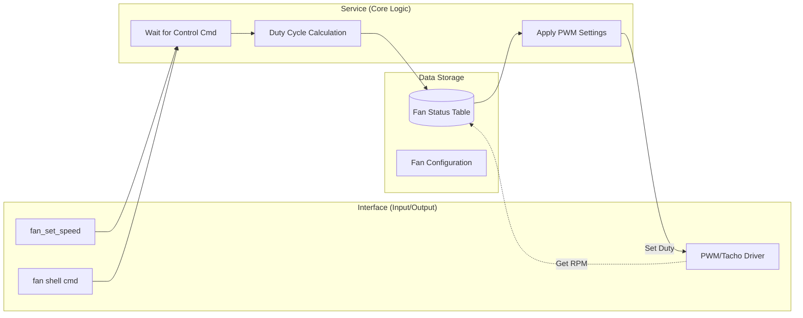

# Fan service

## Architecture


## Test
```shell
uart:~$
uart:~$ fan info
Fan Index | Status  | Target % | Current RPM | Duty Cycle
-------------------------------------------------------
   0      | Running |   30%    |    1850     |   76/255
   1      | Idle    |    0%    |       0     |    0/255

uart:~$
uart:~$ fan set 0 80
Fan 0 speed set to 80% successfully
[00:12:45.102,345] <inf> fan: Adjusting Fan 0 PWM duty to 204
uart:~$
uart:~$ fan info
Fan Index | Status  | Target % | Current RPM | Duty Cycle
-------------------------------------------------------
   0      | Running |   80%    |    4520     |   204/255
   1      | Idle    |    0%    |       0     |    0/255

uart:~$
uart:~$ fan stop 0
Fan 0 stopped successfully
uart:~$
```