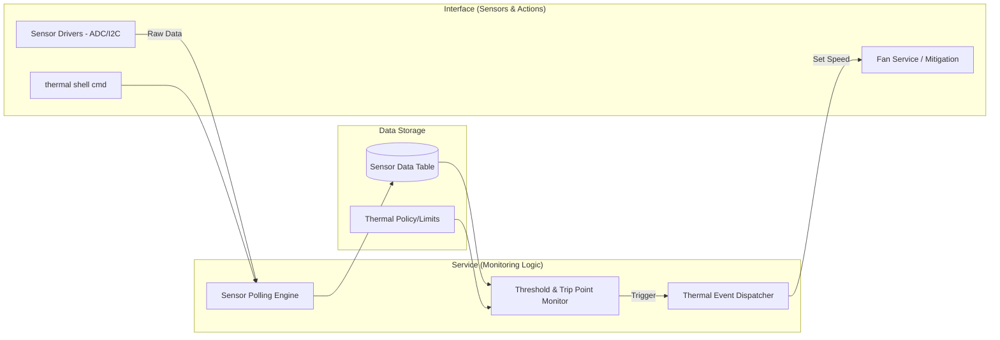

# Thermal service

## Architecture


## Test
```shell
uart:~$
uart:~$ thermal info
Sensor ID | Name          | Temperature | Critical Trip | Status
--------------------------------------------------------------
   0      | SoC Internal  |    45.2 C   |    105.0 C    | Normal
   1      | DDR Channel   |    38.5 C   |     95.0 C    | Normal
   2      | Skin Ambient  |    32.0 C   |     60.0 C    | Normal

uart:~$
uart:~$ thermal set_trip 0 critical 100
Thermal SoC Internal critical trip point set to 100.0 C

uart:~$
uart:~$ thermal status
Current State: Passive Cooling
Active Mitigations: Fan Service (Level 2)

uart:~$
uart:~$ thermal poll
[00:15:22.450,000] <inf> thermal: Manual sensor refresh triggered
SoC Internal: 45.5 C
uart:~$
```